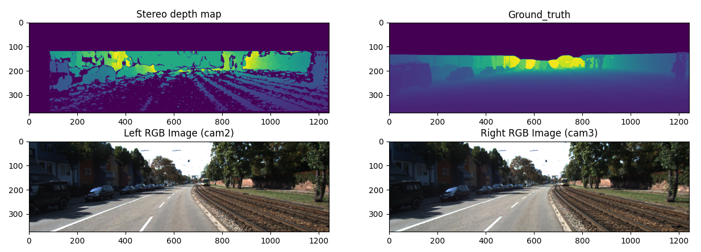

# Kitty-stereo-dataset-parser

This parser is build upon pykitty repo made by utiasSTARS available at: [utiasSTARS/pykitti]. I decided to build my own parser for evaluation of tradition stereo vision technique which is available in opencv library. Just for simplicity reasons I incorporated whole pykitty repo in my own repo. This way anyone who would like to use this repo won't need to download pykitty.

## Features
- Right and left rectified images from both views of stereo vision system
- Ground truth map generated from lidar data transformed to image plane
- Distance map generated based on disparity map produced by stereo vision system

## Data

First step is to download data from [kitty site]. You can choose whichever dataset you want (it should not matter). For example purpose we will use dataset labeled as  "2011_09_26_drive_0001". Download `synced+rectified data` and `calibration data` and unzip it. Move both uziped folders to repo's data folder.

Repo's stucture tree should look like:
```
Stereo
│   README.md
│   LICENCE
│   ...
│───data
│       │─── 2011_09_26
│           │   calib_cam_to_cam.txt
│           │   calib_imu_to_velo.txt
│           │   calib_velo_to_cam.txt
│           │─── 2011_09_26_drive_0001_sync
│───pykitty
│       │   ...
```

## Install dependencies

Create and activate virtual environment:
```sh
conda create -n yourenvname python=3.7
```
```sh
conda activate yourenvname
```

Go to root and install needed dependencies:
```sh
pip install -r requirements.txt
```

## How to use

Go to `source/parse_data.py` and run. The script should produce an image shown bellow:



## Acknowledgment

Thank you for good work! https://github.com/utiasSTARS/pykitti


   [utiasSTARS/pykitti]: <https://github.com/utiasSTARS/pykitti>
   [kitty site]: <http://www.cvlibs.net/datasets/kitti/raw_data.php>
